# MCP Agentic System - Execution Flow Logic

This document describes the overall execution flow and architecture of the MCP Agentic System.

## System Architecture Diagram

```mermaid
graph TB
    User[👤 User Query] --> ChatUI[🌐 Flask Web UI]
    ChatUI --> API[📡 Flask API /api/query]
    
    API --> LoadHistory[📚 Load Last 5 Messages]
    LoadHistory --> IntentLLM[🤖 LLM Intent Detection<br/>GPT-4.1-nano<br/>with conversation context]
    IntentLLM --> |Detects: search/summarize/conversation_query| PlannerLLM[🧠 LLM Planner<br/>GPT-4.1-nano<br/>with conversation context]
    
    PlannerLLM --> |Plans execution stages| Orchestrator[🎯 Orchestrator]
    
    Orchestrator --> StateMgr[💾 State Manager<br/>CSV Backend]
    StateMgr --> |Loads existing context| Orchestrator
    
    Orchestrator --> |Based on planned stages| MCPClients{MCP Clients}
    
    MCPClients --> |Search| SearchClient[🔍 SearchClient]
    MCPClients --> |Summarize| SummaryClient[📝 SummaryClient]
    
    SearchClient --> |HTTP POST| SearchServer[🌐 Search MCP Server<br/>:8001]
    SummaryClient --> |HTTP POST| SummaryServer[🌐 Summary MCP Server<br/>:8002]
    
    SearchServer --> |Serper API| ExternalSearch[🔎 Serper API]
    SummaryServer --> |OpenAI API| ExternalLLM[🤖 OpenAI GPT-4.1-nano]
    
    SearchServer --> |Results| SearchClient
    SummaryServer --> |Results| SummaryClient
    
    SearchClient --> |Results| Orchestrator
    SummaryClient --> |Results| Orchestrator
    
    Orchestrator --> |Saves state| StateMgr
    Orchestrator --> |Response| API
    API --> |JSON Response| ChatUI
    ChatUI --> |Display Results + Intent| User
```



## Detailed Execution Flow

### 1. User Query Submission
```
User → Flask Web UI → POST /api/query
```

### 2. Load Conversation History
```
Flask API → load_rows() from state.csv
         → Gets last 5 messages for context
         → Passes to intent detection
```

### 3. Intent Detection (LLM with Context)
```
Flask API → detect_intent_with_llm(query, history)
           → GPT-4.1-nano analyzes query with last 5 messages as context
           → Returns: "search" | "summarize" | "conversation_query"
```

**Intent Detection Logic:**
- **search**: User asks a question or wants to search for NEW information
- **summarize**: User wants a summary of previous agent responses
- **conversation_query**: User asks about previous conversations (e.g., "What did we discuss?")

### 4. State Management
```
Orchestrator → get_or_create_row(query, intent)
             → Loads state.csv
             → For "summarize" intent: finds most recent context
             → Returns row with existing context or creates new row
```

### 5. Execution Planning (LLM Planner with Context)
```
Orchestrator → plan_execution_stages(query, intent, current_state, history)
             → GPT-4.1-nano analyzes:
                - User query
                - Detected intent
                - Existing state (what's already done)
                - Last 5 messages for context
             → Returns: ["search"] | ["summarize"] | ["conversation_query"]
             → Only plans stages that need to execute
```

**Planning Rules:**
- If intent is "search": Execute `["search"]`
- If intent is "summarize": Execute `["summarize"]` (summarizes last 3 agent responses)
- If intent is "conversation_query": Handled separately, no planning needed

### 6. Stage Execution (Orchestrator)

The `orchestrate()` function directly calls MCP clients inline for each planned stage:

#### Search Stage
```python
if stage == "search":
    if not row.get("search_results"):
        r = search_client.search(query)  # Direct MCP client call
        row["search_results"] = r["text"]
        row["search_confidence"] = str(r["confidence"])
    executed_stages.append("search")
```

**Flow:**
1. Call `search_client.search(query)` directly
2. HTTP POST to Search MCP Server (:8001)
3. Search Server calls Serper API
4. Returns search results with confidence

#### Summarize Stage
```python
if stage == "summarize":
    if not row.get("summary"):
        all_rows = load_rows()
        rows_with_content = [r for r in all_rows if r.get("search_results", "").strip() or r.get("summary", "").strip()]
        sorted_rows = sorted(rows_with_content, key=lambda x: int(x.get("turn", "0")), reverse=False)
        last_3_summaries = sorted_rows[-3:]
        # Prepare messages and combine text
        combined_text = "\n\n".join([f"Response {i+1}: {text}" for i, text in enumerate(summary_texts)])
        r = summary_client.summarize([combined_text])  # Direct MCP client call
        row["summary"] = r["text"]
        row["summary_confidence"] = str(r["confidence"])
    executed_stages.append("summary")
```

**Flow:**
1. Load all rows from state.csv
2. Find last 3 rows with agent responses (search results or summaries)
3. Combine those 3 responses
4. Call `summary_client.summarize(combined_text)` directly
5. HTTP POST to Summary MCP Server (:8002)
6. Summary Server calls OpenAI GPT-4.1-nano
7. Returns summary of last 3 agent responses

**Important**: Summarize now summarizes the last 3 agent responses from conversation history, NOT search results. MCP client calls are inlined directly in the orchestration loop.

#### Conversation Query Stage
```
if intent == "conversation_query":
    → generate_conversation_response(query, history)
    → GPT-4.1-nano analyzes conversation history
    → Generates response about previous conversations
    → Returns conversation response
```

### 7. State Persistence
```
Orchestrator → Updates row with results
             → save_rows(rows)
             → Writes to state.csv
             → Maintains full conversation history (no limit)
```

### 8. Response Formation
```
Orchestrator → Adds metadata (_executed_stages, _planned_stages)
             → Returns row with results
             → Flask API includes:
                - Detected intent
                - Executed stages
                - Results for executed stages only
                - Last 5 messages for UI display
             → Returns JSON to UI
```

## Component Responsibilities

### LLM Intent Detection (`orchestrator.py`)
- **Input**: User query string, conversation history (last 5 messages)
- **Output**: Intent classification ("search", "summarize", "conversation_query")
- **Model**: GPT-4.1-nano
- **Purpose**: Understand what the user wants to do, considering conversation context
- **Context**: Last 5 messages are included in the prompt

### LLM Planner (`orchestrator.py`)
- **Input**: User query, detected intent, current state, conversation history
- **Output**: List of stages to execute (e.g., `["search"]` or `["summarize"]`)
- **Model**: GPT-4.1-nano
- **Purpose**: Plan which stages need to run, considering existing context and conversation history
- **Key Logic**: 
  - Only execute minimum required stages
  - Summarize doesn't require search results (summarizes agent responses)

### Orchestrator (`orchestrator.py`)
- **Manages**: Overall execution flow
- **Responsibilities**:
  - Loads conversation history (last 5 messages)
  - Calls intent detection with context
  - Loads/saves state
  - Calls planner with context
  - **Directly calls MCP clients inline** for each planned stage (no wrapper functions)
  - Handles conversation queries separately
  - Tracks executed stages
- **Architecture**: MCP client calls are inlined directly in the `orchestrate()` function's stage execution loop for simplicity

### MCP Clients (`common.py`)
- **SearchClient**: Wraps search server communication
- **SummaryClient**: Wraps summary server communication
- **All**: Make HTTP POST requests to respective MCP servers

### MCP Servers (`servers.py`)
- **Search Server** (port 8001): Calls Serper API for web search
- **Summary Server** (port 8002): Calls OpenAI GPT-4.1-nano for summarization
- **All**: Expose JSON-RPC endpoints

### State Management (`orchestrator.py`)
- **Storage**: CSV file (`state.csv`)
- **Fields**: query, turn, search_results, search_confidence, summary, summary_confidence, reviewed_summary, review_confidence, insights, insights_confidence
- **Purpose**: 
  - Maintain full conversation history (no limit)
  - Enable context reuse across queries
  - Track multi-turn conversations
  - Provide last 5 messages for LLM context

## Key Design Decisions

### 1. Conversation Context
- Last 5 messages are passed to LLM for intent detection and planning
- System maintains full conversation history in CSV
- UI displays all past conversations in sidebar

### 2. User-Driven Execution
- System only executes stages explicitly requested
- LLM planner determines what needs to run
- No automatic pipeline execution

### 3. Summarization of Agent Responses
- When user asks to summarize, system summarizes last 3 agent responses
- Not limited to search results
- Provides conversation-level summarization

### 4. Conversation Query Handling
- Special intent for questions about previous conversations
- Uses LLM to generate responses based on conversation history
- Separate execution path from search/summarize

### 5. LLM-Based Planning
- Intent detection: LLM analyzes user query with conversation context
- Execution planning: LLM decides which stages to run with context
- Context-aware: Planner considers existing state and conversation history

### 6. Simplified Architecture
- Consolidated files: `common.py`, `orchestrator.py`, `servers.py`
- Only two MCP servers: Search and Summary
- Three intents: search, summarize, conversation_query

## Example Execution Flow

### Scenario 1: Search and Summarize

1. **User**: "Latest trends in AI"
   - Intent: `search`
   - Context: No previous messages
   - Planned: `["search"]`
   - Executed: `["search"]`
   - State: Saved with search results

2. **User**: "Summarize"
   - Intent: `summarize`
   - Context: Last 5 messages include previous search
   - Planned: `["summarize"]`
   - Executed: `["summarize"]`
   - Action: Finds last 3 agent responses, summarizes them
   - Result: Summary of last 3 agent responses

### Scenario 2: Conversation Query

1. **User**: "What did we discuss earlier?"
   - Intent: `conversation_query`
   - Context: Last 5 messages from conversation history
   - Planned: `["conversation_query"]`
   - Executed: `["conversation_query"]`
   - Action: LLM generates response based on conversation history
   - Result: Response about previous conversations

### Scenario 3: Multiple Searches

1. **User**: "Latest AI trends"
   - Intent: `search`
   - Executed: `["search"]`
   - Saved to state.csv

2. **User**: "Latest ML trends"
   - Intent: `search`
   - Context: Last 5 messages include previous search
   - Executed: `["search"]`
   - Saved to state.csv

3. **User**: "Summarize"
   - Intent: `summarize`
   - Context: Last 5 messages include both searches
   - Executed: `["summarize"]`
   - Action: Summarizes last 3 agent responses (which may include summaries from previous queries)

## Data Flow Summary

```
User Query
    ↓
Load Conversation History (last 5 messages)
    ↓
Intent Detection (LLM with context)
    ↓
State Loading (CSV)
    ↓
Execution Planning (LLM with context)
    ↓
Stage Execution (Orchestrator → MCP Clients → MCP Servers → External APIs)
    ↓
State Saving (CSV - full history)
    ↓
Response (Filtered to executed stages only + intent + history)
    ↓
UI Display (Results + Intent + Past Conversations sidebar)
```

## UI Features

### Intent Display
- Shows detected intent above chat messages
- Formats: 🔍 Search, 📝 Summarize, 💬 Conversation Query

### Past Conversations Sidebar
- Displays all conversation history (no limit)
- Shows query and summary preview for each conversation
- Updates automatically after each query
- Scrollable list

### Layout
- Chat area and sidebar together occupy 90% screen width
- Narrow gap between chat and sidebar
- Centered layout with equal margins
